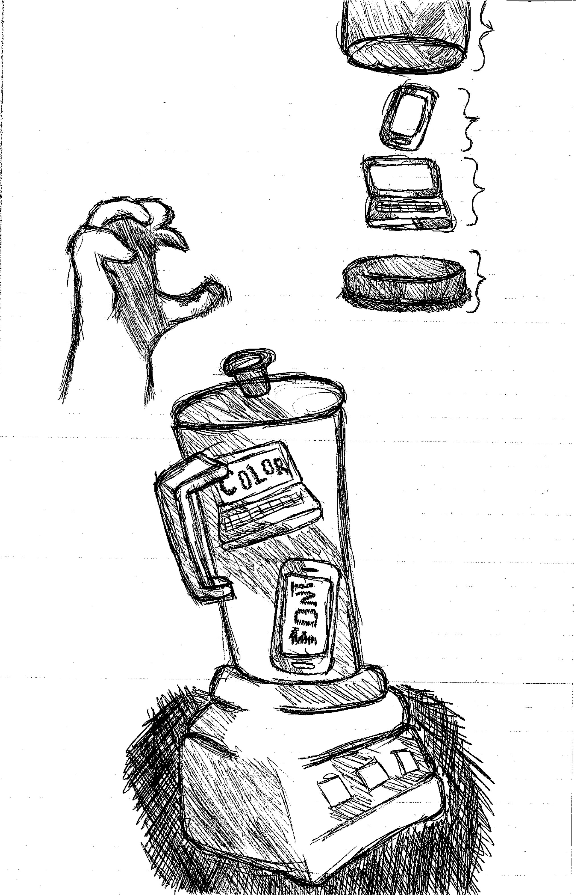

# Ebb & Flow 
## Work In Progress 

- [Draft](#draft) 
- [Ilustration](#illustration) 
- [Best Practices](#best-practices) 
- [About the Author](#about-the-author)

- - -

# Draft

# Summary

A Dao of Web Design by John Allsopp in short pertains to the fact that design is nothing more than another turn of the century thing with rules and concepts. It’s like when paper became a huge thing and rules were made for typesetting and now it has all become standard. The same can be said for web design in the sense that there are rules for the universal platform of the internet whether it be a mobile device or a desktop. As a designer one has to be able to dictate the web page while also understanding that there is a great deal outside of what is in control. Allow the design to be set to a standard while also being flexible to all viewers and users alike.

# Illustration

- - -

## Best Practices

### Naming Things 

- Use lowercase for naming files, folders, and in markup 
- Use a hyphen (-) or an underscore (_) and not a space (%20) when separating phrases in naming files, folders, and in markup.

### Project (Folder, Repo) Structure 

#### For Example 

- project-name
  - README.md
  - index.md
  - index.html
  - img/
  
  # About the Author 
  
Jylik Donell Buissereth is an 18 year old artist currently attending Montserrat College of Art. He was born and raised in New York until moving to Massachusets for college. As an artsist he is primarily a graphic designer however he has an immense appreciation for sculpture and enjoys working in wood more than anything. 
  
  
